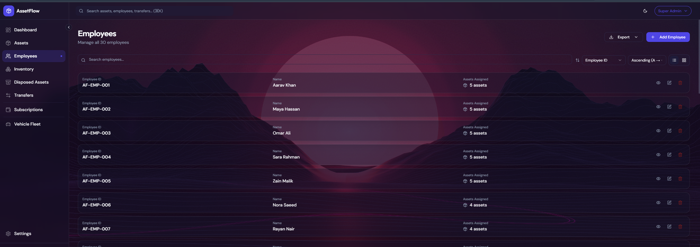
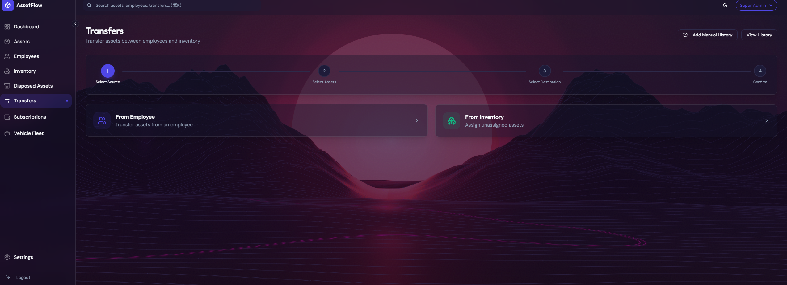
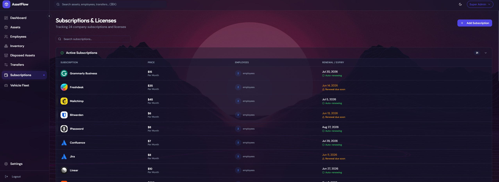
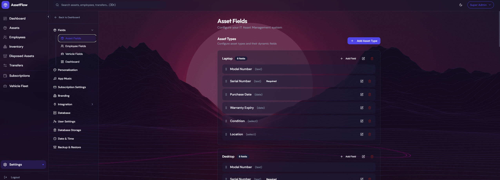
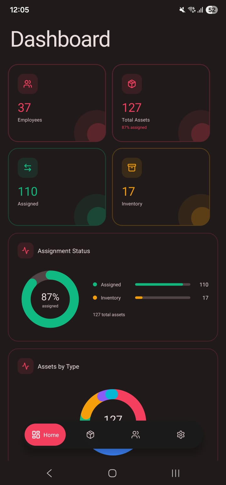
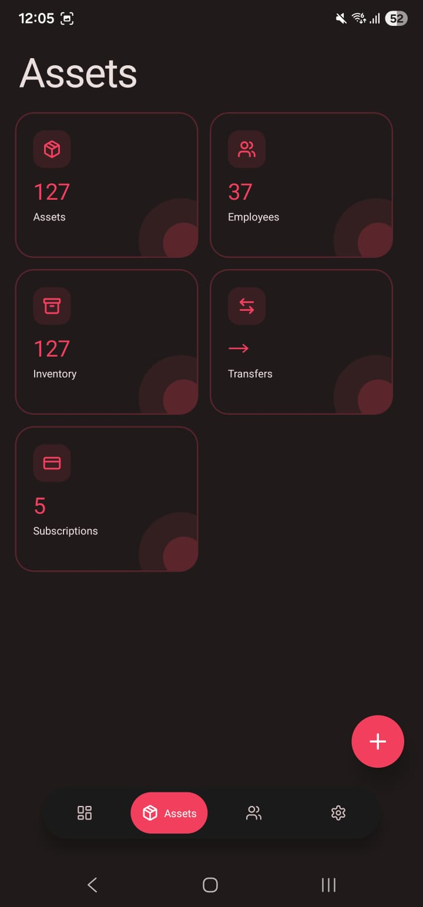
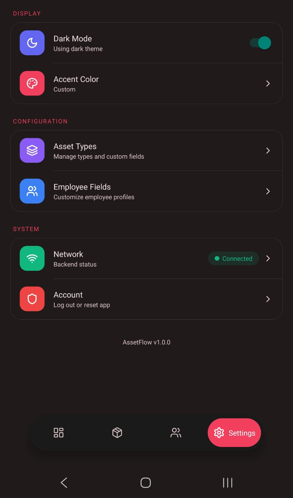

<div align="center">


# AssetFlow

<strong>Self-hosted IT asset, employee, subscription, transfer, and vehicle fleet management platform.</strong>

Built for internal teams that need clear ownership tracking, controlled asset movement, Docker-based deployment, and a modern web dashboard backed by MongoDB.

<br>

<a href="#quick-glance"></a>
<a href="#screenshots"></a>
<a href="#local-setup"></a>
<a href="#vps-deployment"></a>

<br><br>


</div>

<br>

<p align="center">
  
  
</p>

<p align="center">
  <sub>Docker-first operations dashboard, mobile companion, and traceable asset lifecycle records in one self-hosted system.</sub>
</p>

---

## Table Of Contents

- [Quick Glance](#quick-glance)
- [Scope And Intent](#scope-and-intent)
- [Current Validated Setup](#current-validated-setup)
- [App Specification](#app-specification)
- [What The App Does](#what-the-app-does)
- [Feature Overview](#feature-overview)
- [Screenshots](#screenshots)
- [Mobile Screenshots](#mobile-screenshots)
- [Architecture Overview](#architecture-overview)
- [Docker Runtime Model](#docker-runtime-model)
- [Local Setup](#local-setup)
- [VPS Deployment](#vps-deployment)
- [Data And Storage](#data-and-storage)
- [Security And Access Control](#security-and-access-control)
- [Mobile App](#mobile-app)
- [Project Structure](#project-structure)
- [Repository Notes](#repository-notes)

> [!TIP]
> Use the links above to jump to a section. Most sections are collapsible, so open only the details you need.

## Quick Glance

| Item | Details |
| --- | --- |
| Primary purpose | Internal IT asset lifecycle and resource management |
| Current deployment model | Docker Compose |
| Local app URL | `http://localhost:8080` |
| Frontend | React, TailwindCSS, Radix UI, Framer Motion, Recharts |
| Backend | FastAPI, Uvicorn, Motor, PyMongo |
| Database | MongoDB 7 container by default |
| Reverse proxy | nginx inside the frontend container |
| Mobile companion | React Native / Expo Android app |
| Default fresh login | `admin@local.internal` / `Admin123!` |
| Main setup docs | `LOCAL_SETUP.md` and `VPS_DEPLOYMENT.md` |

AssetFlow is a Docker-first internal management system for assets, employees, inventory, transfers, disposed assets, subscriptions, vehicle fleet records, settings, branding, integrations, backup/restore, and mobile access.

The current project no longer depends on the old manual Python/Node installer flow. The standard setup is Docker Compose.

## Scope And Intent

<details>
<summary><strong>Open section</strong></summary>

<br>

AssetFlow is built for organizations that need a practical internal system to answer questions like:

- who currently owns each IT asset
- which assets are still in inventory
- which assets were disposed and why
- what was transferred, from whom, to whom, and when
- which SaaS subscriptions are active, expired, or renewing soon
- what vehicles belong to the company fleet
- how much database storage the installation is using
- which users can view, write, or administer the system

The project is intended for self-hosted internal use, not as a public multi-tenant SaaS product.

The current repository is centered around:

- Docker local setup
- Docker VPS deployment
- local MongoDB container by default
- persistent Docker volumes for database and uploads
- one public browser entry point for the app

</details>

## Current Validated Setup

<details>
<summary><strong>Open section</strong></summary>

<br>

The current app has been validated with Docker Compose using:

| Component | Current setup |
| --- | --- |
| Frontend container | nginx serving the React production build |
| Backend container | FastAPI running through Uvicorn on port `8001` inside Docker |
| Database container | MongoDB 7 on the internal Docker network |
| Public local port | `8080` |
| API path | `/api/*` through the frontend nginx proxy |
| Health checks | `/health` and `/api/health` |

Current local browser entry point:

```text
http://localhost:8080
```

Current Docker services:

```text
assetflow-frontend
assetflow-backend
assetflow-mongodb
```

The screenshots in this README were captured from the Docker-running app at `http://localhost:8080` with populated demo data.

</details>

## App Specification

<details>
<summary><strong>Open section</strong></summary>

<br>

### Frontend

| Technology | Purpose |
| --- | --- |
| React 19 | Web application UI |
| React Router | Page routing |
| TailwindCSS | Styling system |
| Radix UI | Accessible UI primitives |
| Framer Motion | Motion and interactive transitions |
| Recharts | Dashboard charts and visual summaries |
| Axios | API client |
| Sonner | Toast notifications |
| lucide-react | Icon system |

### Backend

| Technology | Purpose |
| --- | --- |
| FastAPI | REST API framework |
| Uvicorn | ASGI server |
| Motor | Async MongoDB driver |
| PyMongo | MongoDB support utilities |
| Pydantic | Request and response validation |
| JWT | Authentication tokens |
| bcrypt | Password hashing |
| APScheduler | Scheduled backend tasks |
| httpx / requests | External HTTP integrations |

### Runtime

| Component | Purpose |
| --- | --- |
| Docker Compose | Runs the complete stack |
| MongoDB 7 | Local database service |
| nginx | Serves frontend and proxies API requests |
| Docker volumes | Persist database and uploaded files |

### Mobile

| Technology | Purpose |
| --- | --- |
| React Native | Android mobile app |
| Expo | Mobile build/runtime tooling |
| Zustand | Mobile state management |
| React Navigation | Mobile navigation |
| AsyncStorage | Local mobile persistence |

</details>

## What The App Does

<details>
<summary><strong>Open section</strong></summary>

<br>

AssetFlow centralizes the operational records normally scattered across spreadsheets, chat messages, purchase logs, and manual IT notes.

It tracks:

- employees
- asset types
- physical assets
- asset assignments
- inventory
- disposed assets
- transfer history
- subscriptions and license renewals
- company vehicle fleet records
- users and roles
- settings, branding, integrations, and backup data

The system is built around accountability:

1. Create employees.
2. Define asset types and custom fields.
3. Add assets with structured metadata.
4. Assign assets to employees or keep them in inventory.
5. Transfer assets through a traceable workflow.
6. Dispose assets without losing history.
7. Track subscriptions, costs, renewals, and logos.
8. Maintain vehicle records with PNG vehicle images and custom fields.
9. Control write/admin access through roles.

</details>

## Feature Overview

<details>
<summary><strong>Open section</strong></summary>

<br>

### Dashboard

The dashboard gives a live operational summary of the organization.

Current dashboard areas include:

- total employees
- total active assets
- assigned assets
- inventory assets
- disposed assets
- asset type distribution
- assignment status
- recent transfers
- vehicle fleet preview
- subscription renewal and cost summary
- database storage summary

### Asset Management

Asset records support structured lifecycle management.

Features include:

- custom asset types
- dynamic fields per asset type
- unique asset tags
- assignment to employees
- inventory state for unassigned assets
- warranty and metadata fields
- image support
- asset detail pages
- edit and delete controls based on role

### Employee Management

Employee records are linked directly to assigned assets.

Features include:

- unique employee IDs
- dynamic employee fields
- department and contact-style metadata
- assigned asset visibility
- direct navigation between employees and assets
- role-gated create/edit/delete actions

### Inventory

Inventory is automatically derived from assets that are not assigned to employees.

It helps teams see:

- available devices
- unassigned stock
- devices ready for reassignment
- assets grouped by type

### Disposed Assets

Disposed assets are kept separately instead of being silently lost.

This keeps history clear for:

- retired devices
- damaged devices
- sold or written-off equipment
- audit trails
- lifecycle reporting

### Transfers

Transfers create a traceable movement history for assets.

The transfer flow supports:

- source validation
- employee-to-employee movement
- inventory-to-employee movement
- employee-to-inventory movement
- notes
- manual transfer records
- recent transfer summaries
- full history view

### Subscriptions

The subscription module tracks SaaS tools, renewals, and costs.

Features include:

- subscription name and vendor details
- department association
- renewal dates
- active, expiring, and expired status
- monthly/yearly cost summary
- login URL storage
- server-side logo/favicon fetching
- manual renewal visibility

### Vehicle Fleet

The vehicle fleet module tracks company vehicles with visual PNG vehicle images.

Features include:

- required vehicle name
- required PNG vehicle image
- custom fleet fields
- plate number
- driver
- department
- status
- service date
- insurance expiry
- odometer values
- animated vehicle selector/detail interface

### Settings

Settings are centralized and modular.

Major settings areas include:

- asset fields
- employee fields
- vehicle fields
- branding
- personalization
- integrations
- SMTP
- Monday.com
- database controls
- storage visibility
- date and time settings
- backup and restore
- users and roles

### Music Player

The app includes a global music player layer that can be configured from the system settings.

It is available across authenticated screens and is designed as an internal UI personalization feature.

</details>

## Screenshots

Main AssetFlow screens captured from the running Docker app:

<p align="center">
  
  
</p>

<p align="center">
  
  
</p>

<p align="center">
  
  
</p>

<p align="center">
  
  
</p>

<p align="center">
  
  
</p>

Screenshot files are stored in:

```text
Screenshots/
```

## Mobile Screenshots

Mobile companion app screens:

<p align="center">
  
  
  
</p>

These screenshots show the current Android companion app experience. The mobile app is designed to connect to the same AssetFlow backend URL used by the web system.

## Architecture Overview

<details>
<summary><strong>Open section</strong></summary>

<br>

AssetFlow is organized as a full-stack web app with a mobile companion.

```text
AssetFlow/
├── frontend/             # React web app, built and served by nginx
├── backend/              # FastAPI API server
├── mobile/               # React Native / Expo Android app
├── Screenshots/          # README screenshots
├── docker-compose.yml    # Local/VPS Docker orchestration
├── LOCAL_SETUP.md        # Detailed local Docker guide
├── VPS_DEPLOYMENT.md     # Detailed VPS Docker guide
└── README.md             # Project overview
```

Runtime architecture:

```text
Browser
  |
  v
frontend container
  |
  |-- serves React app
  |
  |-- proxies /api/* requests
        |
        v
    backend container
        |
        v
    mongodb container
```

Important design points:

- the browser uses one public app URL
- frontend nginx proxies API calls internally
- backend is not directly exposed by default
- MongoDB is not exposed publicly
- database and uploads persist through Docker volumes

</details>

## Docker Runtime Model

<details>
<summary><strong>Open section</strong></summary>

<br>

Docker Compose runs three services.

### `mongodb`

```text
Container: assetflow-mongodb
Image: mongo:7
Purpose: persistent database
```

MongoDB data is stored in a Docker volume.

### `backend`

```text
Container: assetflow-backend
Runtime: Python 3.11 slim
Server: Uvicorn
API: FastAPI
Internal port: 8001
```

The backend connects to MongoDB using the internal Docker hostname:

```text
mongodb://mongodb:27017
```

### `frontend`

```text
Container: assetflow-frontend
Runtime: nginx
Public local port: 8080 by default
Internal container port: 80
```

nginx serves the React app and proxies:

```text
/api/* -> backend:8001
```

This is why the browser only needs:

```text
http://localhost:8080
```

</details>

## Local Setup

<details>
<summary><strong>Open section</strong></summary>

<br>

The recommended local setup is Docker Compose.

Quick start:

```bash
cp .env.example .env
docker compose up --build -d
docker compose ps
```

Open:

```text
http://localhost:8080
```

Default fresh login:

```text
Email:    admin@local.internal
Password: Admin123!
```

Useful commands:

```bash
docker compose logs -f backend frontend mongodb
docker compose down
docker compose up --build -d
```

For the full local setup guide, read:

```text
LOCAL_SETUP.md
```

</details>

## VPS Deployment

<details>
<summary><strong>Open section</strong></summary>

<br>

The recommended production-style deployment is Docker Compose on a VPS.

Typical VPS flow:

```bash
git clone https://github.com/mazinxperia/AssetFlow.git assetflow
cd assetflow
cp .env.example .env
nano .env
docker compose up --build -d
docker compose ps
```

For a direct HTTP VPS deployment, `.env` usually contains:

```env
FRONTEND_PORT=80
JWT_SECRET=replace-this-with-a-long-random-production-secret
CORS_ORIGINS=http://your-domain.com,http://your_vps_public_ip
```

For HTTPS/domain deployment:

```env
FRONTEND_PORT=80
JWT_SECRET=replace-this-with-a-long-random-production-secret
CORS_ORIGINS=https://your-domain.com,http://your-domain.com
```

For the full VPS guide, including Docker install, firewall, DNS, updates, backups, and HTTPS options, read:

```text
VPS_DEPLOYMENT.md
```

</details>

## Data And Storage

<details>
<summary><strong>Open section</strong></summary>

<br>

AssetFlow stores operational data in MongoDB.

Main data categories include:

- users
- employees
- asset types
- assets
- disposed assets
- transfers
- subscriptions
- music tracks
- vehicles
- vehicle files
- settings
- branding files
- uploaded assets

In Docker, persistence is handled through volumes:

| Volume | Stores |
| --- | --- |
| `mongodb_data` | MongoDB database files |
| `backend_uploads` | uploaded files |

Safe stop:

```bash
docker compose down
```

Full local reset:

```bash
docker compose down -v
docker compose up --build -d
```

Important:

- `docker compose down` keeps data
- `docker compose down -v` deletes database and uploads
- production backups should include both MongoDB and upload volumes

</details>

## Security And Access Control

<details>
<summary><strong>Open section</strong></summary>

<br>

AssetFlow uses JWT-based authentication and role-based access control.

### Roles

| Role | Access |
| --- | --- |
| `SUPER_ADMIN` | Full system access, settings, users, integrations, destructive controls |
| `ADMIN` | Write access for operational records |
| `USER` | Read-only access |

### Protected Areas

Write/admin controls are guarded at both UI and backend levels.

Protected areas include:

- user management
- settings
- asset creation/editing
- employee creation/editing
- transfer operations
- vehicle changes
- subscription changes
- system configuration

### Production Checklist

Before using AssetFlow publicly:

- change the default admin password
- set a strong `JWT_SECRET`
- keep `.env` out of Git
- expose only the frontend/reverse proxy port
- keep MongoDB private inside Docker
- use HTTPS for public domains
- back up MongoDB and uploaded files
- restrict VPS SSH access where possible

</details>

## Mobile App

<details>
<summary><strong>Open section</strong></summary>

<br>

AssetFlow includes a React Native / Expo Android companion app in:

```text
mobile/
```

The mobile app connects to the same FastAPI backend as the web app. It does not use a separate backend or database.

> [!IMPORTANT]
> The mobile app currently works as a companion client for the existing backend URL, login flow, and supported mobile screens. It has not yet been updated to include every latest web feature, so newer modules such as Vehicle Fleet, Disposed Assets, the newest dashboard widgets, and newer web-only settings may not appear inside the mobile app yet. The web dashboard remains the complete and most up-to-date AssetFlow experience.

Mobile features include:

- onboarding flow
- backend URL connection setup
- login with AssetFlow credentials
- dashboard summary
- asset viewing and management
- employee viewing and management
- subscriptions
- inventory
- transfers
- user/account screens
- offline readability for cached data
- reconnect handling when backend is unavailable

Mobile build command:

```bash
cd mobile
npm install
eas build -p android --profile preview
```

This requires EAS CLI and an Expo account.

</details>

## Project Structure

<details>
<summary><strong>Open section</strong></summary>

<br>

```text
AssetFlow/
├── backend/
│   ├── server.py              # FastAPI application and API routes
│   ├── requirements.txt       # Python dependencies
│   └── Dockerfile             # Backend container build
├── frontend/
│   ├── src/
│   │   ├── components/        # Shared UI and layout components
│   │   ├── context/           # Auth, theme, branding providers
│   │   ├── pages/             # Dashboard, assets, employees, settings, etc.
│   │   └── services/          # API clients
│   ├── nginx.conf             # Frontend nginx and API proxy config
│   ├── package.json           # Frontend dependencies
│   └── Dockerfile             # Frontend production build and nginx image
├── mobile/
│   ├── src/                   # React Native app source
│   ├── App.js                 # Mobile app entry
│   └── package.json           # Mobile dependencies
├── Screenshots/               # README screenshot assets
├── docker-compose.yml         # Full stack Docker orchestration
├── .env.example               # Local/VPS environment template
├── LOCAL_SETUP.md             # Detailed local Docker instructions
├── VPS_DEPLOYMENT.md          # Detailed VPS Docker deployment instructions
├── package.json               # Root helper scripts
└── README.md                  # Project documentation
```

</details>

## Repository Notes

<details>
<summary><strong>Open section</strong></summary>

<br>

Current documentation direction:

- `README.md` explains the product and architecture
- `LOCAL_SETUP.md` explains local Docker setup in detail
- `VPS_DEPLOYMENT.md` explains VPS Docker deployment in detail

Removed old documentation and installer direction:

- manual Windows installer
- manual macOS installer
- old cloud-only deployment guide
- duplicate Docker deployment guide

The repo should now communicate one clear setup model:

```text
Use Docker.
```

Before publishing or handing off the project, review:

- `.env` is not committed
- screenshots are safe to show
- default credentials are changed after first deployment
- production VPS has backups configured

</details>
